# NEXUS Siembras


Aplicación de control agropecuario para pequeños productores. Un solo código Flutter que corre en **Android**, **Web** y **Windows Desktop**, con sincronización offline-first vía Supabase.

-   **Desarrollador:** NEXUS CREATIO
-   **Package Android:** `com.nexuscreatio.nexus_siembras`
-   **Versión:** 0.2.6 · [Notas de versión (What's new)](docs/WHATS_NEW.md)
-   **Fase actual:** Fase 3 completa + banco comunitario de variedades, colaboración multi-propietario reforzada, trazabilidad de compras y paquete ZIP de comprobantes (2026-07-30). Próximo: web de consulta (drift_wasm).

## Alcance funcional

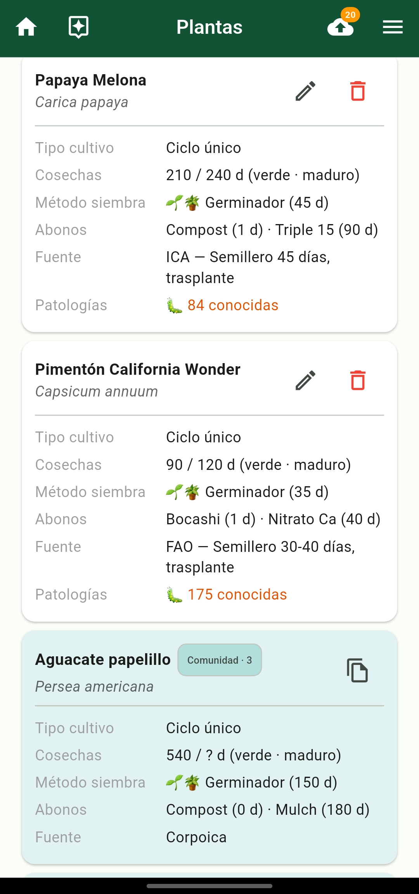 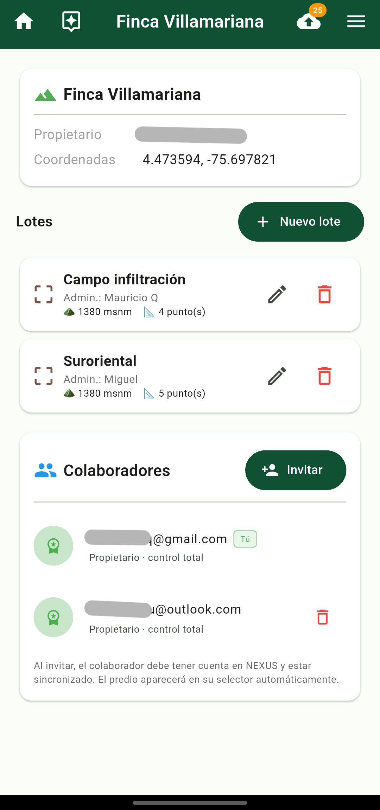 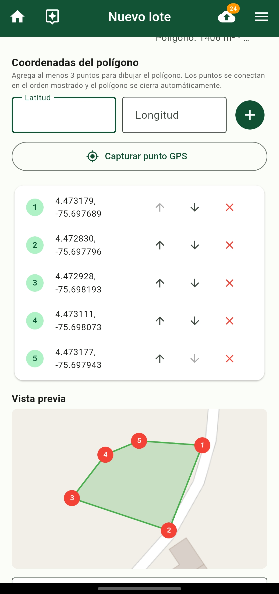

-   Catálogo de plantas/variedades con condiciones edafoclimáticas óptimas, **tipo de cultivo por defecto** (ciclo único o perenne), **periodos de cosecha** y **ciclos de fertilización** configurables (múltiples abonos con tipo y días desde siembra/trasplante). **Banco comunitario:** descarga de variedades compartidas por otros usuarios (caché local + botón **Sincronizar comunidad**); listado unificado en Plantas, Agregar cultivo y el asistente.
-   Registro de cultivos por predio y lote con georreferenciación GNSS y **tipo de ciclo productivo**:
    -   **Ciclo único:** días estimados hasta Cosecha 1 (verde/tierno) y Cosecha 2 (maduro/seco).
    -   **Cultivo perenne:** días hasta la primera cosecha, periodicidad entre cosechas y esperanza de vida hasta renovación.
    -   Los valores se **precargan desde la variedad** seleccionada y pueden ajustarse al crear el cultivo.
-   Modelo de etapas fenológicas: siembra directa vs. germinador → trasplante → fenología; eventos de abono generados desde los ciclos definidos en la variedad.

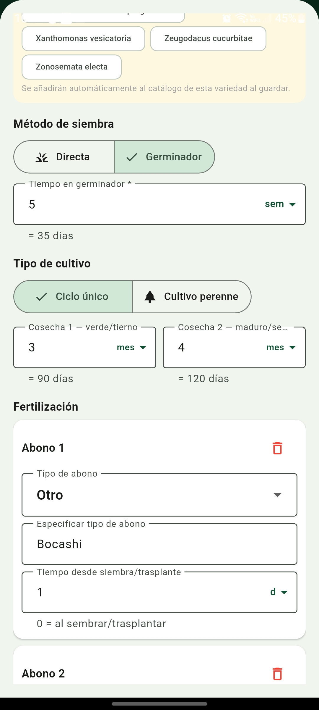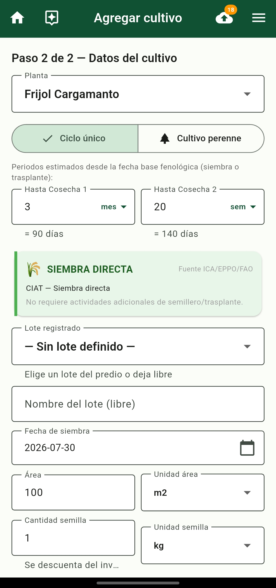

-   Cronograma en tres vistas: Gantt, calendario y actividades registradas. **Ajuste dinámico:** al registrar una tarea con fecha distinta a la programada, los eventos pendientes posteriores se desplazan automáticamente; el detalle del cultivo muestra tipo, periodos configurados y cronograma completo.

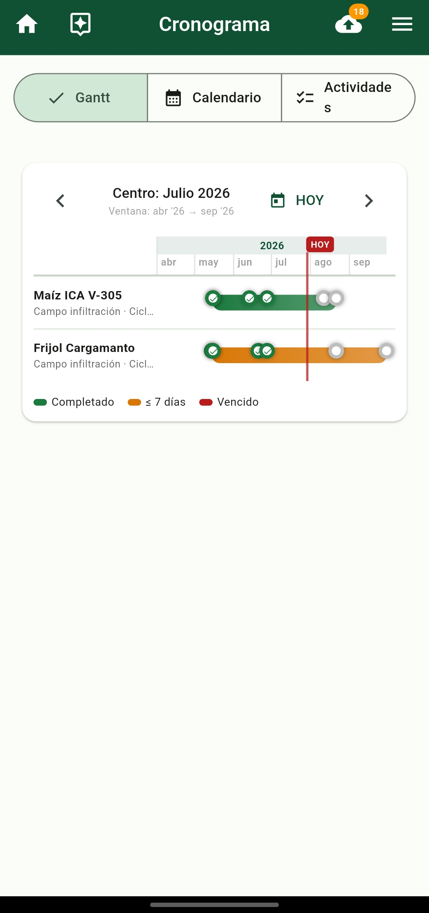 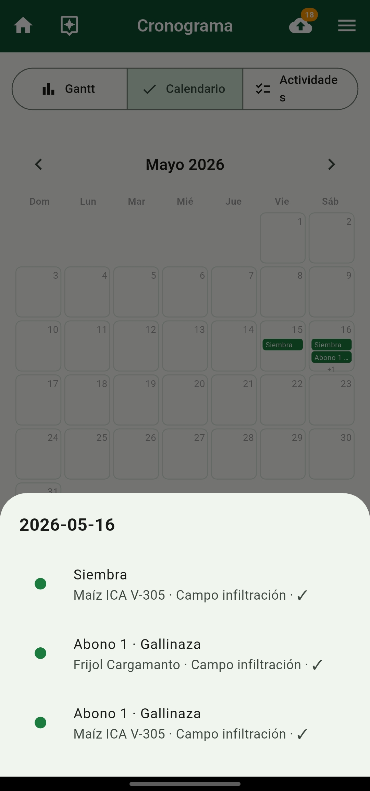 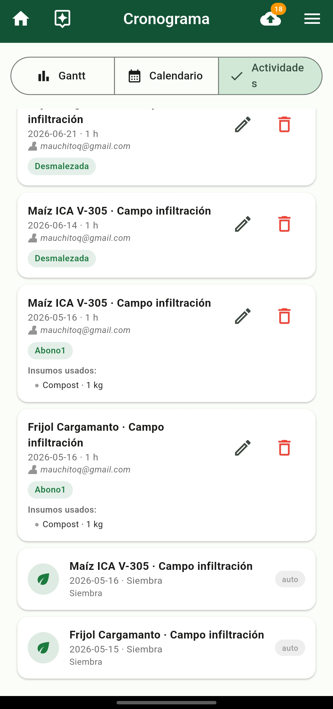

-   Registro de tareas completadas con acumulación de HH e insumos consumidos del inventario. Actividades base ampliadas para perennes: **Cosecha periódica** (con periodicidad configurable; extiende eventos futuros) y **Renovación** (marca el cultivo como finalizado).

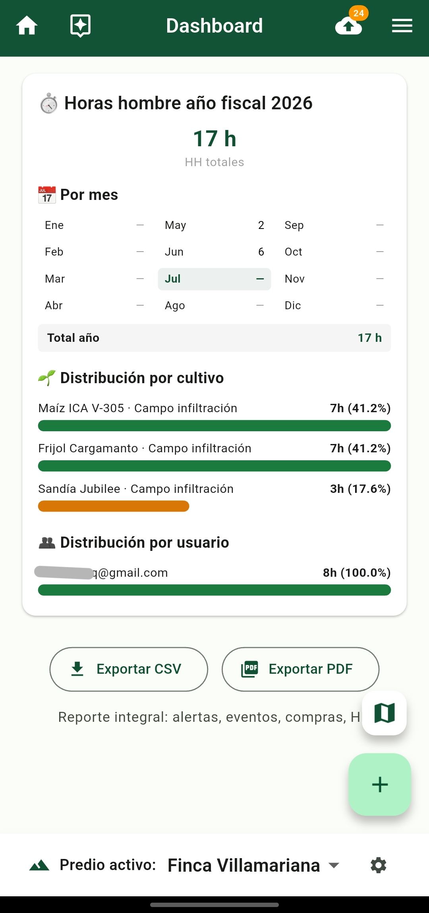 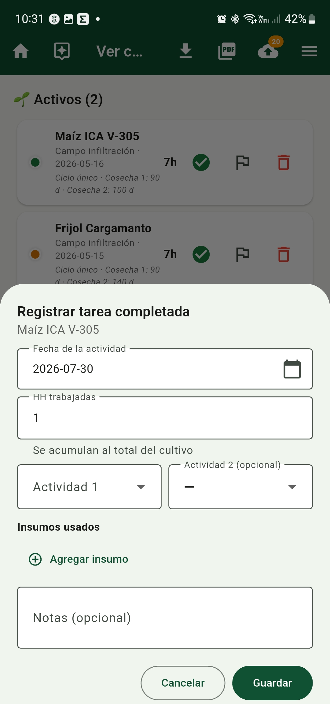

-   Compras por año fiscal con **comprobante adjunto real** (PDF o foto), archivado como `soportes/{año}/{Proveedor}-{factura}.{ext}`. En predios con **co-propietarios**, cada compra muestra **quién la registró** (email). Exportación **CSV/PDF** resumida y paquete **ZIP completo** (reporte extendido con identificación de facturas + carpeta `comprobantes/` con los adjuntos).

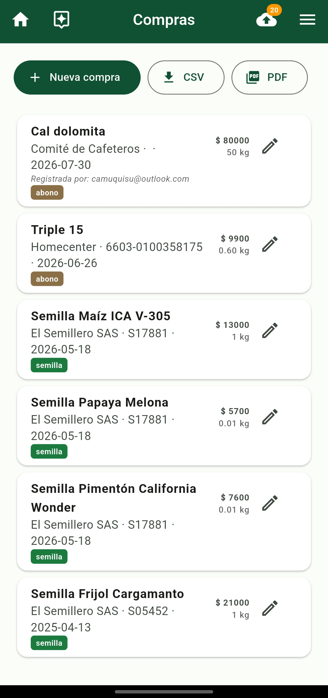 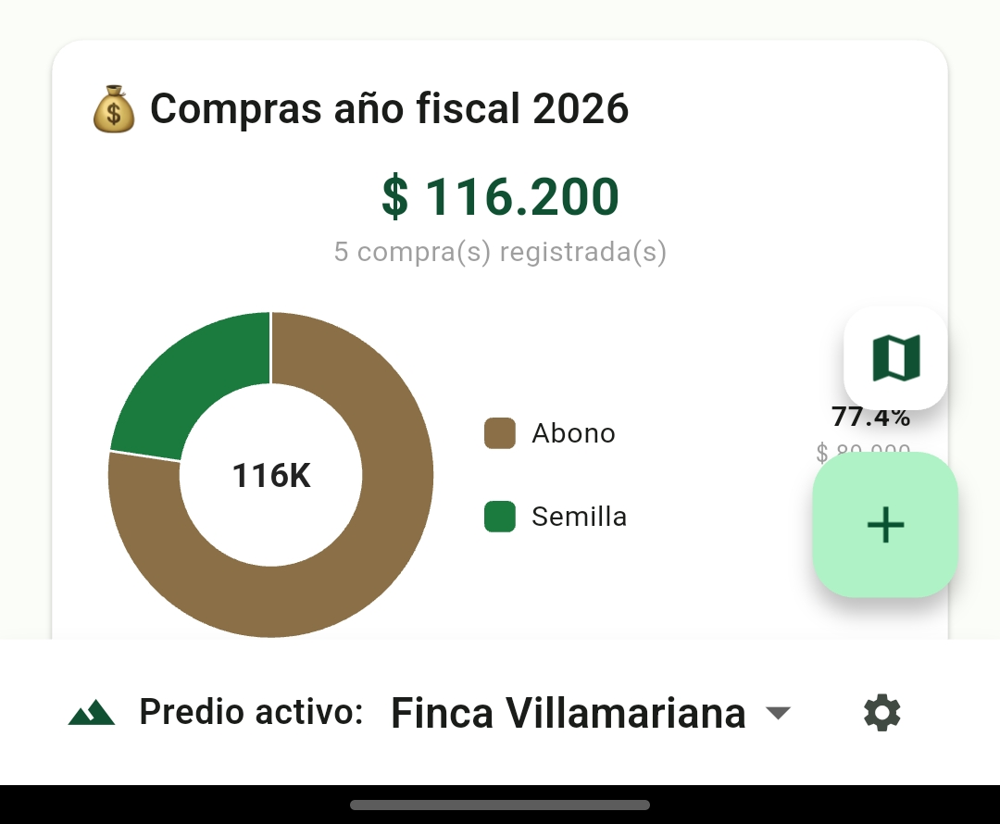

-   Análisis fisicoquímicos de suelo por lote (con **PDF del laboratorio adjunto** opcional) y condiciones edafoclimáticas por predio.

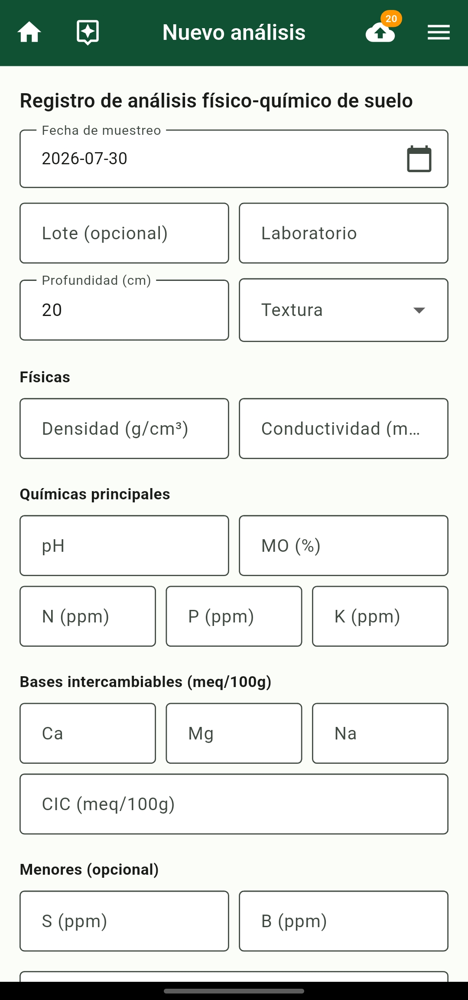

-   **Onboarding con geolocalización:** "Obtener GPS" llena coordenadas/altitud y detecta país/región/municipio por geocodificación inversa (Nominatim). Paso **Ubicación omitible**; fix Android de BD cifrada tras reinstalar (SQLCipher + exclusión del `.sqlite` del backup en la nube).

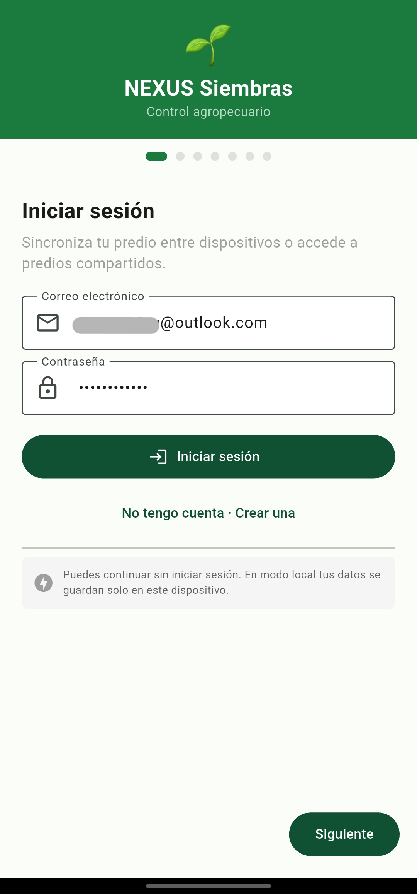 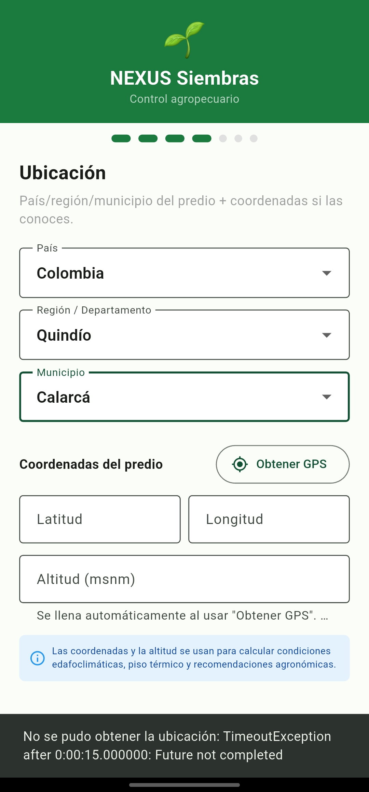

-   **Asistente paso a paso** (10 pasos): guía la configuración inicial — predio → lote → condiciones → análisis de suelo → proveedores → variedades → compra → inventario → cultivos → mapa. Con avance/retroceso sin perder progreso (el estado se deriva de la BD) y pasos obligatorios validados. Se ofrece tras el onboarding y queda accesible desde el menú y la barra superior.

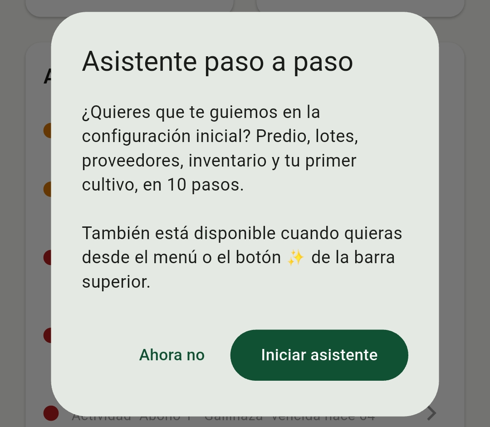

-   **Multi-usuario:** un mismo predio puede tener propietario + colaboradores con roles `trabajador` o `consultor`, con permisos diferenciados por RLS de Postgres. **Hidratación garantizada** de recursos compartidos en cada sync (condiciones, suelo, lotes, cultivos, inventario, compras para co-propietarios, eventos, tareas y **proveedores del equipo**). Los co-propietarios pueden crear cultivos y demás recursos editables; todo se sincroniza con el dueño del predio.

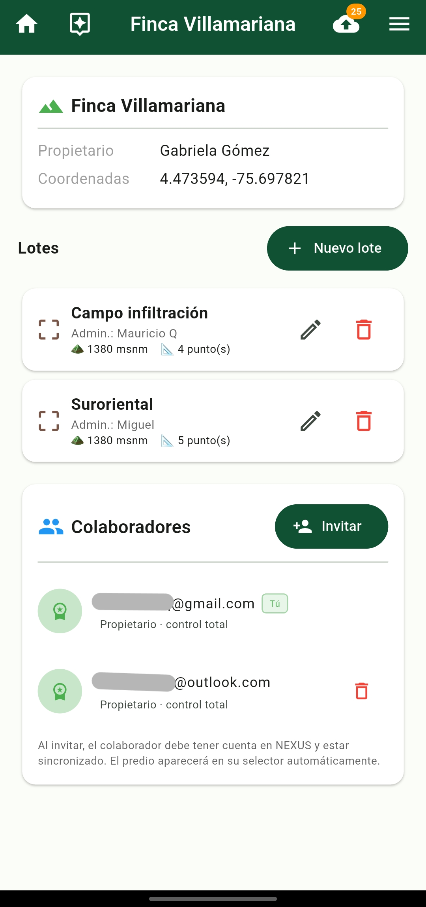

-   **Contribución comunitaria** (opt-in): compartir reportes de patologías anonimizados al catálogo global (fotos re-encodificadas sin EXIF/GPS).

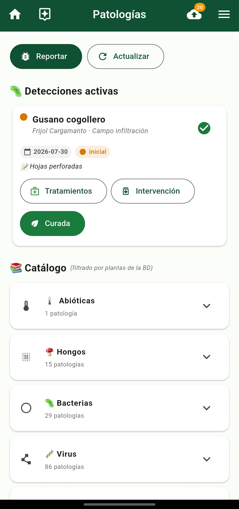

-   **Pantalla Mapa** (`/map`): capas base OSM/Satélite (Catastro IGAC deshabilitado por defecto), polígonos de lotes, marcadores de cultivos, capas opcionales (todos mis cultivos, heatmap de patologías) y tap sobre zonas calientes del heatmap. **Brújula flotante** con indicador **N** que rota según la orientación del mapa (giro con dos dedos); al tocarla, reorienta automáticamente con el norte arriba (`MapController.rotate(0)`). **Botón de ubicación GPS** inicia un stream en tiempo real (`Geolocator.getPositionStream`), muestra marcador azul con halo de precisión, centra el mapa y lo sigue hasta que el usuario arrastra la vista manualmente. El mapa se renderiza aunque no haya cultivos ni lotes (útil para orientarse con GPS desde el primer uso).

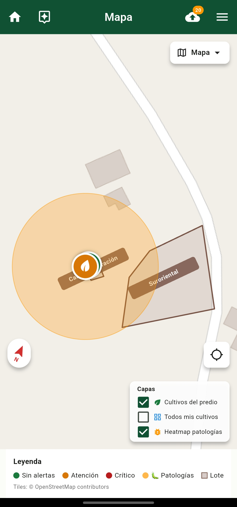

-   Integración **EPPO Global Database** (token opcional) con verificación de salud del API y certificate pinning. Modal **Nueva variedad** con debounce ampliado para evitar consultas EPPO excesivas mientras se escribe.

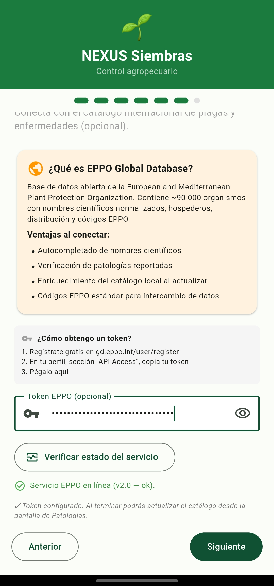

-   **Catálogo de patologías** con reclasificación manual por grupo (abióticas, hongos, bacterias, virus, plagas, deficiencias, otras) sin que «Actualizar» pise la elección del usuario.


-   **Catálogo de tratamientos por patología** con 214 entradas y priorización automática por el país del predio activo: primero los tratamientos nacionales, luego los globales, y dentro de cada grupo los de mayor sostenibilidad (culturales y biológicos antes que químicos).
-   **Campos de duración con unidad** (días / semanas / meses / años) en variedades, cultivos y tareas; la BD sigue guardando días.
-   Notificaciones locales de eventos próximos y vencidos.
-   **Exportación CSV/PDF en todas las pantallas de datos:** Dashboard (reporte integral: alertas de cultivos, próximos eventos, compras del año con gráfico circular, HH por mes, distribución por cultivo y por usuario), Cultivos (estado + patologías activas), Inventario, Compras y Proveedores. Encabezado con los datos reales del predio activo.
-   **Pantalla Reportes:** genera todos los reportes (integral, cultivos, inventario, compras, proveedores) y un **consolidado** en un solo PDF; listado de reportes generados con Ver/Compartir/Eliminar; logotipo personalizado para el encabezado (con el ícono de la app como respaldo); y logs de diagnóstico con compartir y limpieza de caché.

    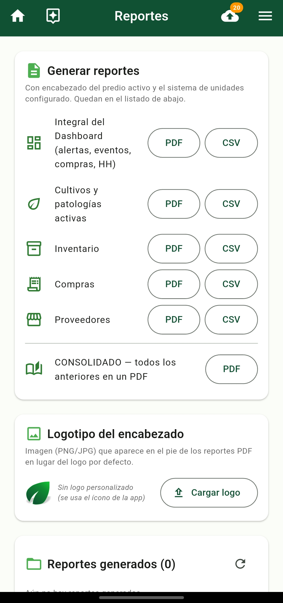

-   **Adjuntos visualizables:** los comprobantes de compra y PDFs de laboratorio se abren desde la app (preview nativo para PDF, visor con zoom para fotos) y se comparten con apps externas.
-   **Backup local** (sin cuenta): exportar/importar el predio completo a JSON desde Configuración.
-   **Seguridad:** BD local cifrada (SQLCipher, clave en Keystore/Keychain/DPAPI), sync por lotes con verificación de versión de esquema remoto.

## Stack técnico

-   **Framework:** Flutter 3.22+ / Dart 3.4+
-   **Estado:** Riverpod (`flutter_riverpod ^2`)
-   **Router:** `go_router`
-   **BD local:** Drift 2.x sobre **SQLCipher** (schema **v19**, cifrada) — offline-first. Clave en `flutter_secure_storage` (Keystore/Keychain/DPAPI). Requiere OpenSSL para compilar en Windows.
-   **Sync remoto:** Supabase (Postgres + Auth + Storage + RLS) — pull paginado, push por lotes, cursor con tiempo del servidor, verificación de `schema_meta`.
-   **Auth:** email/password vía `supabase_flutter ^2.16` (publishable key)
-   **Permisos:** `permission_handler ^11.3`
-   **GNSS:** `geolocator` (captura puntual en formularios + stream en tiempo real en Mapa) · **Geocodificación inversa:** Nominatim (OSM)
-   **Mapa:** `flutter_map` + `latlong2` (capas, rotación, brújula, seguimiento GPS)
-   **Notificaciones:** `flutter_local_notifications`
-   **Reportes:** `pdf` + `printing` + `csv` + `archive` (ZIP de compras)
-   **Adjuntos:** `file_picker` + `image_picker` (+ `image` para strip de EXIF)
-   **Seguridad:** `crypto` (pinning TLS EPPO), `sqlcipher_flutter_libs`
-   **Env:** `flutter_dotenv`

## Requisitos previos

1.  Flutter SDK 3.22 o superior — `flutter --version`
2.  Android Studio con SDK 36 y device/emulador
3.  Cuenta gratuita en [Supabase](https://supabase.com/dashboard) (opcional — la app funciona en modo local sin ella)
4.  VS Code o Android Studio con extensiones Dart + Flutter

## Setup

```powershell
cd nexus_siembras
flutter pub get
dart run build_runner build --delete-conflicting-outputs
```

### Configurar Supabase (opcional)

Sin `.env` la app arranca en modo 100% local: no hay sincronización ni multi-usuario, pero todas las demás funciones operan.

Para habilitar sync/multi-usuario:

1.  Crear proyecto en Supabase Dashboard.
2.  Copiar y editar `.env`:

```powershell
Copy-Item .env.example .env

SUPABASE_URL=https://xxxxx.supabase.co
SUPABASE_PUBLISHABLE_KEY=sb_publishable_...
SYNC_MODE=offline_first
```

(La `SUPABASE_ANON_KEY` legacy sigue soportada como respaldo, pero conviene rotarla — auditoría S1.)

3.  En el SQL Editor de Supabase, ejecutar en el orden documentado en `supabase/migrations/README.md` (fuente canónica): `schema.sql` → `schema_3e.sql` → `schema_3e_v2..v4.sql` → `schema_3g.sql` → `fix_predio_shares_updated_at.sql` → `migrations/0007_schema_meta_y_triggers_updated_at.sql` (tabla `schema_meta` + triggers `updated_at` del lado servidor), luego `migrations/0008_banco_variedades.sql`, `0009_rls_reportes_privacidad.sql`, `0010_cultivos_tipo_ciclo.sql`, `0011_compras_created_by.sql`. El cliente verifica `schema_meta.version` antes de cada sync.
4.  **Pin TLS de EPPO** (si se usará el token EPPO): ejecutar `dart run tool/eppo_fingerprint.dart` desde una red de confianza y pegar el SHA-256 en `_eppoPins` (`lib/services/eppo_client.dart`). Ya están anclados el certificado hoja y el intermedio Sectigo vigentes.

### Diagnóstico y mantenimiento

-   `supabase/diagnostico_sync_colaborador.sql` — bloques SQL para verificar el estado del share, RLS y visibilidad al colaborador. Ejecutar bloque por bloque en el SQL Editor.
-   `supabase/cleanup_duplicados.sql` — limpieza de filas duplicadas si el sync se corrompió.
-   `supabase/fix_share_visibilidad.sql` — auto-fix idempotente cuando un predio compartido no aparece en la Cuenta B tras sincronizar (Fase 3e-9-3).
-   `supabase/fix_predio_shares_updated_at.sql` — agrega `updated_at` + trigger a `predio_shares` para que los cambios de rol se detecten en el pull incremental (Fase 3e-9-4).
-   `supabase/fix_shares_invertidos.sql` — purga filas espurias de `predio_shares` con rol='propietario' u `owner_id` que no coincide con el owner real del predio (Fase 3e-9-9).

## Ejecutar

```powershell
# Android (device o emulador conectado)
flutter run

# Android en un device específico
flutter devices                       # lista devices
flutter run -d <device_id>

# Web (Chrome)
flutter run -d chrome

# Windows desktop
flutter run -d windows
```

## Compilar release

```powershell
# APK Android — build\app\outputs\flutter-apk\app-release.apk
flutter build apk --release

# Web — build\web\
flutter build web --release

# Windows — build\windows\x64\runner\Release\
flutter build windows --release

# Instalador Windows (Inno Setup 7) — dist\NexusSiembras-Setup-*-win-x64.exe
flutter build windows --release
& "C:\Program Files\Inno Setup 7\ISCC.exe" script-install-winx64.ini
```

## Estructura del proyecto

```
nexus_siembras/
├── android/                # Config Android (compileSdk 36, permisos, firma)
├── web/                    # Manifest PWA e íconos
├── windows/                # Config Windows desktop
├── lib/
│   ├── main.dart           # Entry point (init dotenv, Supabase, notifs)
│   ├── app.dart            # MaterialApp + gating de onboarding
│   ├── router.dart         # Rutas go_router
│   ├── core/
│   │   ├── log.dart        # Logger central (reemplaza print)
│   │   ├── models/         # CicloAbono (ciclos de fertilización JSON)
│   │   ├── theme/          # Material y accesible
│   │   ├── units/          # Catálogo y conversiones de unidades
│   │   ├── widgets/        # AppShell, SyncBadge, UnitDropdown, DuracionField, AutorLabel…
│   │   └── reports/        # exportCsv/exportPdf, ZIP compras, reporte integral, export_helpers
│   ├── data/
│   │   ├── database/       # Schema Drift (v19), migraciones, conexión SQLCipher
│   │   ├── repositories/   # CultivoRepository, PlantaRepository…
│   │   └── seed/           # Catálogo inicial (idempotente)
│   ├── features/
│   │   ├── onboarding/     # 6 pasos: login → preferencias → predio → ubicación → permisos → consentimiento
│   │   ├── auth/           # Login y perfil de cuenta
│   │   ├── dashboard/      # KPIs, alertas, HH, compras del año
│   │   ├── crops/          # Ver/agregar cultivos, detalle, registrar tareas, tipo/periodos/cronograma
│   │   ├── plants/         # Catálogo de variedades (tipo cultivo, periodos, ciclos de abono)
│   │   ├── predios/        # Admin de predios + colaboradores
│   │   ├── inventory/      # Inventario por predio
│   │   ├── purchases/      # Compras por año fiscal
│   │   ├── schedule/       # Gantt / Calendario / Actividades
│   │   ├── map/            # Mapa interactivo: capas, heatmap, brújula, GPS en tiempo real
│   │   ├── soil/           # Análisis fisicoquímicos
│   │   ├── wizard/         # Asistente paso a paso (10 pasos)
│   │   ├── reports/        # Central de reportes + logs de diagnóstico
│   │   └── settings/       # Configuración general
│   ├── services/           # SupabaseService, SyncService (batch+paginado+hidratación),
│   │                       # VariedadesComunitariasService, SecureStore, SoporteService,
│   │                       # GeocodingService, EppoClient (pinning TLS),
│   │                       # BackupService, NotificationService…
│   └── state/              # Providers Riverpod (auth_state, data_state, app_state)
├── supabase/               # Schemas SQL + scripts de diagnóstico
│   └── migrations/         # Fuente canónica (README con orden + 0007 schema_meta)
├── tool/                   # eppo_fingerprint.dart, import_excel.dart
├── script-install-winx64.ini  # Instalador Inno Setup 7 para Windows x64
├── docs/                   # Auditoría, parches aplicados, pruebas E2E
├── assets/                 # imágenes, animaciones, .env
├── test/
├── pubspec.yaml
├── .env.example
└── README.md
```

## Modelo de datos

**Local (Drift sobre SQLCipher, schema v19).** Tablas principales: `predios`, `lotes`, `cultivos`, `plantas`, `plantaFotos`, `inventarios`, `compras` (con `soportePath` y `createdByUserId`), `proveedores`, `analisisSuelo` (con `soportePath`/`soporteTipo`), `condicionesPredio`, `eventosCultivo`, `tareasCompletadas`, `patologias`, `cultivoPatologias`, `patologiasEspecies`, `tratamientosPatologias`, `predioColaboradores`, `patologiasReportadas`, `variedadesComunitariasCache`, `configs`, `syncMappings`, `syncTables`, `syncOps`.

Campos relevantes añadidos en **v15–v19**:

| Versión | Tabla / cambio                        | Uso                                         |
|---------|---------------------------------------|---------------------------------------------|
| v15     | `cultivos.*` tipo/periodos            | Ciclo único vs perenne en cada cultivo      |
| v16     | `plantas.*` tipo/periodos/abonos JSON | Defaults al agregar cultivo                 |
| v17     | `patologias.tipoManual`               | Reclasificación manual de patologías        |
| v18     | `variedades_comunitarias_cache`       | Espejo local del banco comunitario Supabase |
| v19     | `compras.createdByUserId`             | Autor de cada compra (co-propietarios)      |

**Remoto (Postgres + RLS).** Espejo de las tablas anteriores más `predio_shares`, `variedades_comunitarias`, `schema_meta` (versión de esquema verificada por el cliente) y funciones `SECURITY DEFINER`. Migraciones en `supabase/migrations/`: `0010_cultivos_tipo_ciclo.sql`, `0011_compras_created_by.sql`, `0008_banco_variedades.sql`, etc. (orden completo en `supabase/migrations/README.md`).

-   `rol_en_predio(predio_id)` → `'propietario' | 'trabajador' | 'consultor' | NULL`
-   `puede_ver_predio(predio_id)` — cualquier rol
-   `puede_editar_predio(predio_id)` — propietario o trabajador
-   `es_propietario_predio(predio_id)` — solo propietario

Reglas de acceso resumidas:

| Recurso                     | Propietario             | Trabajador    | Consultor |
|-----------------------------|-------------------------|---------------|-----------|
| Predio, lotes               | R/W                     | R             | R         |
| Cultivos, eventos, tareas   | R/W                     | R/W           | R         |
| Inventario                  | R/W                     | R/W (consumo) | R         |
| Compras                     | R/W                     | —             | —         |
| Análisis suelo, condiciones | R/W                     | R             | R         |
| Colaboradores               | R/W (solo dueño invita) | —             | —         |

La columna «Propietario» cubre tanto al **dueño del predio** como a los **colaboradores invitados con rol** `propietario` (co-propietarios): ambos ven y registran compras del mismo predio, y esas compras se sincronizan entre ellos. Trabajador y consultor no ven la pantalla Compras (ni en el menú, dashboard, reportes ni el asistente). Invitar o cambiar roles sigue reservado al dueño real del predio, para no generar shares invertidos (`predio_shares.owner_id` debe coincidir con `predios.owner_id`).

## Estado de fases

-   [x] **2a-2f** — Scaffold, capa de datos, temas, i18n, widgets base, MVP.
-   [x] **3a-3d** — Multi-predio, GNSS, cronograma, análisis de suelo, notificaciones, reportes PDF.
-   [x] **3e** — Multi-usuario: shares con roles, RLS refinado, patologías comunitarias, onboarding con login opcional.
-   [x] **3f** — Higiene: cronograma con Siembra/Semillero, GNSS en modal de predio, CRUD de variedades, README.
-   [x] **3g** — Trazabilidad de tareas y HH por usuario + desglose en Dashboard (schema Drift v9 + Postgres schema_3g).
-   [x] **3h** — Auto-población local de patologías al catálogo desde variedades (schema Drift v10 con `PatologiasEspecies`).
-   [x] **3i-A** — Botón "Actualizar" en Patologías carga catálogo bundleado `assets/data/catalogo_patologias.json` (29 patologías con relaciones por especie) y hace merge idempotente.
-   [x] **3i-B** — Integración EPPO API con token del usuario en Settings. Schema Drift v11 añade `Configs.eppoToken`. `EppoClient` consulta batch names2codes → pests-by-host → codes2prefnames. El botón "Actualizar" ahora complementa el catálogo bundleado con datos EPPO cuando hay token válido.
-   [x] **3e-5** — Reporte de patologías con foto (cámara/galería) + GNSS + contribución opt-in a la comunidad (schema Drift v12).
-   [x] **3e-6** — Mapa con capas seleccionables (cultivos del predio, todos mis cultivos, heatmap de patologías reportadas) sobre OSM/Satélite.
-   [x] **3e-6b (2026-07-25)** — Mapa: brújula flotante (`_MapCompass`) con aguja orientada al norte geográfico según la rotación de la cámara; toque reorienta al norte. Botón de ubicación GPS con `Geolocator.getPositionStream` (actualización cada \~3 m), marcador + círculo de precisión, centrado y seguimiento automático (se desactiva al arrastrar el mapa). El mapa ya no queda en blanco cuando no hay cultivos/lotes — muestra aviso y permite usar GPS. Controles en esquina inferior izquierda (brújula) e inferior derecha (GPS, sobre el panel de capas). Implementado en `lib/features/map/map_screen.dart`.
-   [x] **3e-7** — Tap sobre zona caliente del heatmap → bottom sheet con lista de reportes agrupados por proximidad (radio 120 m).
-   [x] **3e-8** — Catálogo de tratamientos por patología (schema Drift v13) con priorización por país del predio activo. Asset bundleado con \~40 tratamientos priorizando prácticas culturales y biológicas. Botón "Tratamientos recomendados" en catálogo, tarjeta de detección activa y bottom sheet del heatmap.
-   [x] **3e-8b (B7)** — Tratamientos por país completados: catálogo ampliado de 51 a **214 tratamientos** con cobertura de **19 países LATAM** (antes solo CO). Priorización sostenible reforzada: 123 culturales + 64 biológicos + 22 orgánicos frente a 5 químicos (95% de sostenibilidad alta). Incluye preventivos globales nuevos para las patologías que solo tenían una entrada (tizón temprano, sigatoka, oidio, botritis, manchas y marchitez bacterianas, virosis TYLCV/TSWV, nematodos, deficiencias nutricionales y estrés hídrico) y paquetes nacionales con fuente institucional real (SENASICA/INIFAP, EMBRAPA, ANACAFE, IHCAFE, ICAFE, SENASA, INIA, INIAP, AGROSAVIA, CORBANA, FHIA, IPTA, SENAVE, INISAV, entre otras) para roya del café, broca, sigatoka negra, gusano cogollero, tizón tardío, roya de soya/trigo, mosca blanca, botritis/oidio de vid, antracnosis, nematodos, trips y hormigas cortadoras. El asset lleva un aviso de verificación regulatoria ante la autoridad sanitaria local.
-   [x] **3e-9** — Plan de pruebas end-to-end multi-usuario (`docs/PRUEBAS_MULTI_USUARIO_E2E.md`) + script `supabase/verificacion_e2e.sql` para validación de estado en Postgres.
-   [x] **3e-9-3** — Fix regresión de sincronización de predios compartidos: el push de shares ahora envía `aceptado_at` explícito y el pull tiene una 2ª pasada que reintenta bajar predios cuya visibilidad depende de shares recién descubiertos. Auto-fix Postgres en `supabase/fix_share_visibilidad.sql`.
-   [x] **3e-9-4** — Fix propagación de cambio de rol de colaborador: `_saveMapping` con `bumpLastPushed` opcional (false en pulls), `_mergeShare` con last-write-wins por `updated_at` local, `_pushColaboradores` envía `updated_at`, `predio_shares` gana columna `updated_at` con trigger (`supabase/fix_predio_shares_updated_at.sql`).
-   [x] **3e-9-5** — Causa raíz definitiva: faltaba `POLICY UPDATE` en `predio_shares` — RLS bloqueaba silenciosamente el UPSERT (rama DO UPDATE). Añadida `predio_shares_owner_update` (owner_id = auth.uid()) al mismo script SQL. Reemplazado `catch (_) {}` de `_pushColaboradores` por log para exponer errores futuros.
-   [x] **3e-9-6** — Gating de UI por rol de colaborador: `rolEnPredioProvider` + `permisosPredioActivoProvider` (`PermisosPredio` fromRol) siguen la matriz del README. Botones "Nuevo cultivo / Registrar tarea / eliminar cultivo" ocultos para consultor; FAB "+" del Dashboard oculto si no hay permisos de creación en el predio; "Nuevo ítem / editar / eliminar" del inventario y "Nueva compra / editar" solo para roles autorizados; Análisis de suelo solo propietario. Reportar patología queda abierto también a consultor (el asesor/agrónomo suele detectar y su aporte alimenta el heatmap comunitario). Widget `core/widgets/acceso_denegado.dart` para bloquear entradas por URL directa.
-   [x] **3e-9-7** — Fix el sync aborta con 42501 tras revocarse un share: nuevo helper `_puedoEditarPredioLocal` filtra proactivamente en cada `_push*` (lotes/cultivos/inventarios/análisis/compras/eventos/tareas/condiciones) los recursos de predios sobre los que el usuario ya no tiene permiso de escritura. `_pushCondiciones` gana try/catch por fila. El catch silencioso de `_upsert` ahora emite `print` para exponer errores futuros. Nuevo `_purgarSharesEliminados` al final del pull detecta shares desaparecidos del remoto (DELETE físico del owner) y los marca `deletedAt=now` localmente, dejando al ex-colaborador en estado "sin acceso" en la UI.
-   [x] **3e-9-8** — Fix registros históricos faltantes al recuperar acceso: cuando un colaborador pierde acceso y luego lo recupera, los registros creados durante el intervalo no bajaban porque el pull incremental filtra por `updated_at > lastPulledAt` (los pulls previos avanzaron el cut-off sin ver las filas que RLS bloqueaba). Ahora `_mergeShare` busca también shares eliminados y detecta el caso "recuperando acceso" (share nuevo o reactivado donde soy el colaborador); dispara `_backfillRecursosDePredio` que trae sin filtro temporal lotes, condiciones, cultivos, inventarios, análisis, compras (todo filtrado por `predio_id`), más eventos y tareas (filtrado por `cultivo_id IN`). Los mergers ya hacen LWW por `updated_at` así que no duplican.
-   [x] **3e-9-9** — Fix colaborador aparece como "Propietario" y bloqueo de eliminarlo: (a) `_pushColaboradores` deja de subir filas locales con `rol='propietario'` (esas son informativas del owner en la BD del invitado; subirlas creaba un share invertido en Postgres). (b) Nuevo `_limpiarSharesInvertidos` al final del pull elimina las filas locales espurias con rol='propietario' cuyo `colaboradorUserId` no coincide con el owner real del predio. (c) La card de Colaboradores permite eliminar cualquier fila (incluidas las de rol propietario) excepto la del propio usuario, para que el owner pueda purgar filas fantasma heredadas de syncs viejos. Script `supabase/fix_shares_invertidos.sql` limpia el mismo estado en Postgres.
-   [x] **3e-9-10** — Rescate manual + trigger extra para el backfill de 3e-9-8: (a) nuevo `SyncService.sincronizarDesdeCero()` borra `syncTables` (preservando `syncMappings`) y ejecuta un pull completo — remedio para colaboradores que ya habían sincronizado el share reactivado antes de 3e-9-8 y quedaron sin las tareas históricas. (b) Botón "Resincronizar todo" en la card de Sincronización de la pantalla Cuenta. (c) `_mergeShare` ahora también dispara `_backfillRecursosDePredio` cuando detecta cambio de rol (consultor→trabajador o cualquier bump), no solo transición deleted→activo.
-   [x] **3e-9-11** — Dos fixes de sincronización de cultivos y eventos: (a) `_mergeCultivo` crea un stub de planta local (`nombreComun` + fuente `sync_auto`) cuando el nombre remoto no existe en el catálogo local, permitiendo que cultivos con variedades creadas por otro dispositivo (p. ej. "Yuca enana") sí lleguen al colaborador; el catálogo de plantas no se sincroniza y sin esto el cultivo se descartaba. (b) `CultivoRepository.registrarTarea`, `deleteTareaCompletada` y `resincronizarEventos` ahora bumpean `updatedAt` cada vez que tocan `fechaEjecutada` de `eventos_cultivo`; sin esto el sync incremental no veía el cambio y el Gantt del colaborador quedaba en "Vencido" pese a que las tareas sí bajaban. Rescate: `sincronizarDesdeCero()` ahora también resetea `lastPushedAt` para forzar re-subir los eventos históricos con el bug ya remediado.
-   [x] **3e-9-12** — Reconciliación local de eventos tras cada sync: `sincronizar()` ahora llama `_reconciliarEventosLocales()` que corre `CultivoRepository.resincronizarEventos()` sobre cada cultivo local no borrado. Reabre todos los eventos, cierra siembra/semillero por `fechaSiembra` y para cada tarea completada cierra el primer evento pendiente coincidente. Idempotente. Repara automáticamente el Gantt del colaborador cuando el remoto trae eventos con `fecha_ejecutada=NULL` (bug legacy 3e-9-11) — no requiere que otra cuenta ejecute "Resincronizar todo".
-   [x] **3e-9-13** — Fix el colaborador no recupera permisos tras cambio de rol: `_mergeShare` ahora, cuando yo soy el invitado, además de la fila del owner informativo persiste una "fila representativa" con `colaboradorUserId == mi userId` y `rol = rolInvitado`. `rolEnPredioProvider` consulta esa fila para decidir los permisos de la UI — sin ella el rol resolvía a `null` y B quedaba en modo solo lectura aunque el share remoto dijera "trabajador". La fila NO se sube al remoto (`_pushColaboradores` la filtra por `colaboradorUserId == userId`) y `_purgarSharesEliminados` la marca `deletedAt` cuando el share remoto sobre ese predio desaparece. En la card de Colaboradores del `predio_detail_screen` la fila se oculta cuando el usuario no es propietario, para no verse listado a sí mismo.
-   [x] **3e-9-14** — Fix predio y recursos se duplican tras "Reemplazar nube con local": ese flujo hace wipe+push en el owner, todos los `remote_id` cambian. Los mappings en el colaborador quedan huérfanos y los mergers creaban duplicados con solo permisos de lectura (el share sigue apuntando al predio viejo). Fix: `_mergePredio`, `_mergeLote`, `_mergeCultivo`, `_mergeEvento` y `_mergeTarea` intentan reconciliar por clave natural (predios: nombre+ownerUserId; lotes: predio+nombre; cultivos: predio+fechaSiembra+nombrePlanta; eventos: cultivo+tipo+fechaProgramada+descripción; tareas: cultivo+fecha+hh+actividades) cuando no hay mapping por `remote_id`; adoptan el nuevo mapping y purgan el huérfano.
-   [x] **3f-1** — Onboarding ampliado: paso Ubicación gana botón "Obtener GPS" (`geolocator` + verificación de servicio + permisos) que llena lat/lng/altitud, más campo manual de altitud (msnm). Nuevo paso "EPPO Global Database" (opcional) entre Permisos y Consentimiento para capturar el token de API con visibilidad togglable y explicación de cómo obtenerlo. El token se persiste vía `savePreferences(eppoToken:)` y la altitud por `completeOnboarding(altM:)`. Total de pasos: 7.
-   [x] **Auditoría 2026-07-19** — Seguridad y rendimiento en 4 fases (detalle en `docs/AUDITORIA_SEGURIDAD_RENDIMIENTO_2026-07-19.md` y `docs/PARCHES_APLICADOS_2026-07-19.md`): secretos fuera de git y rotación a publishable key; certificate pinning para EPPO (hoja + intermedio Sectigo, herramienta `tool/eppo_fingerprint.dart`); BD local cifrada con SQLCipher y clave en almacén seguro del SO (migración automática desde BD sin cifrar, con `isolateSetup` para el isolate de Drift en Android); fotos comunitarias sin EXIF/GPS; sync reescrito (mappings en mapa O(1), push por lotes de 200, pull paginado de 500 con cursor del servidor, guards de reentrada, contador de errores y logger central); triggers `updated_at` del lado servidor + tabla `schema_meta` con verificación de versión; seed idempotente; contraseña mínima 8; arranque no bloqueante con init diferida de Supabase.
-   [x] **3f-2** — Onboarding: botón "Verificar estado del servicio" EPPO (GET `/gd/v2/status`) y detección automática de país/región/municipio desde coordenadas GPS (Nominatim + alta automática en catálogo local, `GeocodingService` + `asegurarGeografia`).
-   [x] **3j** — Exportaciones y adjuntos completos: (a) comprobante real en Nueva compra (PDF/foto → `soportes/{año}/{Proveedor}-{factura}.{ext}` vía `SoporteService`); (b) reporte integral del Dashboard en PDF/CSV — cultivos con alertas y próximos eventos primero, compras del año fiscal con gráfico circular por tipo, HH por mes, distribución por cultivo y por usuario (emails vía RPC) — con datos reales del predio activo (`reportPredioProvider`); (c) exportación CSV/PDF en Ver cultivos (estado + patologías activas), Inventario (incluye agotados), Compras (incluye comprobante) y Proveedores; (d) PDF del laboratorio opcional en Análisis de suelo (`analisis_suelo/{año}/{lab}-{fecha}.pdf`); (e) backup local Exportar/Importar operativo desde Configuración (JSON del predio completo, sin requerir cuenta).
-   [x] **B1** — Banco comunitario de variedades: tabla pública `variedades_comunitarias` (RLS de solo lectura autenticada; escritura únicamente vía RPC `contribuir_variedad` SECURITY DEFINER con upsert por nombre+especie y contador de aportes — `supabase/migrations/0008`). En el modal "Nueva variedad": sugerencias con debounce desde el banco (tocar una llena los campos vacíos sin machacar lo escrito) y opt-in "Compartir esta variedad con la comunidad" al guardar (anónimo, requiere sesión, degrada con gracia sin red o sin la migración).
-   [x] **B5** — Cola persistente de sincronización (Drift v14, tabla `sync_ops`): los inserts/updates ya los cubre el sync por estado (la BD local es la cola), pero los DELETE remotos al vaciar la papelera se perdían sin conexión y la fila revivía en el siguiente pull. Ahora `eliminarRemoto` encola la operación si no hay sesión o si el DELETE falla (con deduplicación), y `sincronizar()` procesa la cola ANTES del pull, con reintentos y descarte tras 10 fallos. Las operaciones encoladas cuentan en el badge de pendientes. Retirados los placeholders `enqueue/flushQueue` de `SupabaseService`.
-   [x] **B8** — Pantalla Reportes (`/reports`) + adjuntos visualizables: visor de adjuntos (PDF vía `printing`, imágenes con zoom) desde el tile de compra y el detalle de análisis; recolección de datos de reportes centralizada en `report_data_builder.dart` (una sola fuente para pantallas, Reportes y consolidado); reporte consolidado en PDF; listado de `nexus_*.pdf/csv` generados con Ver/Compartir (`share_plus`)/Eliminar; logotipo personalizado (`branding/logo_personalizado.png`, con el ícono de la app 192px como respaldo y el logo NEXUS como última opción); card de logs de diagnóstico (buffer de sesión en `Log`) con compartir y "Limpiar caché y logs".
-   [x] **Revisión de código 2026-07-20** — 6 hallazgos aplicados: (1) la migración a SQLCipher ya NO deja respaldo en texto claro — verifica la copia cifrada (PRAGMA key + sqlite_master) antes de eliminar el original, y borra respaldos legados `.pre-cifrado.bak` al arrancar; (2) gating por rol en `LoteEditorScreen` y `PlotConditionsScreen` (`AccesoDenegado` — cierra el bypass por URL directa); (3) fotos de patologías sin fallback con EXIF: formato no decodificable se rechaza con mensaje (con 2º intento de decode); (4) snackbars de sync muestran filas actualizadas desde la nube y errores por fila; (5) runbook de rotación del pin EPPO (`docs/RUNBOOK_PIN_EPPO.md`) con checklist de release; (6) migración `0009`: la tabla `patologias_reportadas` solo es legible por su dueño — la lectura comunitaria queda exclusivamente vía la vista anonimizada `patologias_reportadas_publica`.
-   [x] **B4 (parcial)** — i18n en runtime: `lib/core/i18n/app_localizations.dart` carga los ARB de `lib/l10n/` como assets, sin `gen_l10n` (su chequeo de permisos falla en Windows). Incluye delegate, caché por idioma, fallback a español, clave literal como último recurso y la extensión `context.t('clave', {args})` con sustitución de placeholders. ARB es/en/pt ampliados de 75 a **115 claves con paridad verificada**. Migrados el menú lateral completo, los tooltips y el badge de sync (visibles en toda la app); el resto de pantallas queda para migración incremental documentada en `docs/GUIA_I18N.md`.
-   [x] **3k** — Asistente paso a paso (`/wizard`): 10 pasos con validación de obligatorios (predio, lote, proveedores/plantas/inventario si están vacíos) y opcionales omitibles; el avance vive en `wizardStepProvider` y el estado de cada paso se deriva de la BD (navegar a las pantallas reales y volver no pierde nada). Accesos: diálogo al terminar el onboarding, botón en la barra superior junto a Inicio, e ítem del menú. Finaliza en la vista del mapa.
-   [x] **3l (2026-07-25)** — Tipos de cultivo y periodos configurables:
    -   **Variedades** (`plants_screen.dart`): modal Nueva/Editar variedad con selector ciclo único vs perenne, periodos de cosecha según tipo, y ciclos de fertilización dinámicos (botón «Agregar ciclo de abono» con tipo y días). Schema Drift **v16** (`plantas.tipoCultivoDefault`, `periodicidadCosechaDias`, `esperanzaVidaDias`, `ciclosAbonoJson`).
    -   **Agregar cultivo** (`add_crop_screen.dart`): precarga tipo y periodos desde la variedad; perenne incluye 1ª cosecha, periodicidad y vida útil.
    -   **Cultivos** (`crops_list_screen.dart`, `crop_detail_screen.dart`): lista y detalle muestran tipo de cultivo y periodos; detalle incluye cronograma de eventos con fechas efectivas (programada vs ejecutada).
    -   **Actividades perennes:** «Cosecha periódica» y «Renovación» en el modal de tareas; cosechas periódicas se extienden hasta fin de ciclo de vida.
    -   **Cronograma dinámico** (`cultivo_repository.dart`): al registrar una tarea, los eventos pendientes posteriores se desplazan según la diferencia entre fecha real y programada; «Resincronizar eventos» reconstruye el cronograma desde la configuración del cultivo y reaplica tareas.
    -   Schema Drift **v15** en `cultivos` + sync/backup actualizados; migración Postgres `0010_cultivos_tipo_ciclo.sql`.
-   [x] **3m (2026-07-29)** — Campos de tiempo con unidad seleccionable (`core/widgets/duracion_field.dart`): `DuracionField` + `DuracionController` reemplazan los `TextField` que pedían días crudos. La unidad (días / semanas / meses / años) se elige en una lista desplegable **dentro del mismo campo** y el valor se convierte a días antes de persistir, así que la BD sigue almacenando solo días. Al precargar un valor existente se muestra en la unidad más legible (1095 → «3 años», 90 → «3 meses») y el helper indica la equivalencia («= 90 días») cuando la unidad no es días; acepta decimales («1,5 meses» → 45 días). Equivalencias fijas: **mes = 30 días, año = 365 días**. Migrados: variedades (germinador, cosechas 1/2, periodicidad, esperanza de vida), ciclos de abono, agregar cultivo y periodicidad del modal de tareas. Cubierto por pruebas unitarias en `test/widget_test.dart`.
-   [x] **3n (2026-07-29)** — Reclasificación manual de patologías: cada tarjeta del catálogo (`pathologies_screen.dart`) tiene un botón que abre un selector de grupo (abióticas, hongos, bacterias, virus, plagas, deficiencias nutricionales, otras) para moverla cuando la clasificación automática no acierta. La elección se guarda en `patologias.tipoManual` (**Drift v17**) y no en `tipo`, porque «Actualizar» reescribe `tipo` desde el asset/EPPO en cada corrida y pisaría la decisión del usuario. El catálogo de grupos y la resolución del grupo efectivo viven en `features/pathologies/agrupacion_patologias.dart` (única fuente para agrupar, encabezados e iconos); el diálogo está en `reclasificar_patologia_dialog.dart` y permite restaurar la agrupación automática. Las reclasificadas se marcan en la tarjeta y la tabla `patologias` sigue siendo local (sin migración Postgres ni sync).
-   [x] **3o (2026-07-30)** — Hidratación garantizada de predios compartidos (`sync_service.dart`): un colaborador podía quedar atascado con solo el predio y los lotes porque el pull incremental filtra por `updated_at > lastPulledAt` (las filas históricas del dueño quedan bajo el cut-off) y el backfill de 3e-9-8 solo se disparaba por EVENTO (share nuevo/reactivado/cambio de rol) — si ese momento pasaba o el backfill fallaba a mitad, nunca se reintentaba. Ahora `_hidratarPrediosCompartidos()` corre en cada `_pullAll()`: por cada predio ajeno con share activo verifica un marcador persistente en `syncTables` (`hidratado_predio_<remoteId>_<rol>`); si falta, ejecuta `_backfillRecursosDePredio` (condiciones, análisis de suelo, lotes, cultivos, inventario, compras si soy propietario, eventos y tareas) y solo escribe el marcador cuando TODAS las tablas respondieron — un fallo de red deja el marcador sin escribir y la próxima sincronización reintenta. El marcador incluye el rol, así un ascenso trabajador→propietario rehidrata y baja las compras. `_mergeShare` ya no llama al backfill directo: al detectar "recuperando acceso" invalida el marcador y delega. El backfill ahora pagina (500) para predios grandes y loguea filas descartadas.
-   [x] **3p (2026-07-30)** — Onboarding Android: fix `SqliteException(26) file is not a database` en el paso Ubicación y al pulsar Comenzar. Causas: (1) el isolate de fondo de Drift no aplicaba `applyWorkaroundToOpenSqlCipherOnOldAndroidVersions` ni el override de SQLCipher → la BD se creaba/leía con sqlite plano; (2) reinstalar con backup de Android restauraba el `.sqlite` cifrado sin la clave del Keystore. Fix en `db_connection_native.dart`: workaround completo en `isolateSetup`, sonda previa que elimina BD ilegible y la recrea, y exclusión del `.sqlite` del backup en la nube (`res/xml/backup_rules.xml`). Onboarding: paso Ubicación omitible (botón **Omitir** + salto automático si marcó «No crear predio propio»).
-   [x] **3q (2026-07-30)** — Banco comunitario en Plantas: tabla local `variedades_comunitarias_cache` (**Drift v18**) espejo de Supabase; sync al arrancar (con sesión), al iniciar sesión y con botón **Sincronizar comunidad** en la pantalla Plantas. El listado muestra propias + comunitarias (sin duplicar por nombre+especie); las comunitarias llevan chip y se copian al catálogo propio con el botón de copiar. Fix sync `UNIQUE constraint failed: sync_mappings.(tabla, remote_id)` en `_saveMapping` al reconciliar eventos por clave natural.
-   [x] **3r (2026-07-30)** — Listado unificado de variedades (`plantasListadoProvider`) en **Agregar cultivo**, paso 6 del asistente y autocompletados del modal Nueva variedad. Al sembrar con una variedad comunitaria, `addCultivo` la copia automáticamente al catálogo local (`ensurePlantaLocal`) antes de crear el cultivo.
-   [x] **3s (2026-07-30)** — Autor en compras: columna `created_by_user_id` (**Drift v19**, migración Postgres `0011_compras_created_by.sql`); se estampa al crear (sesión Supabase) y se muestra en el listado de Compras como «Registrada por: …» (email vía `emailPorUserIdProvider`).
-   [x] **3t (2026-07-30)** — Paquete ZIP en Compras: botón **ZIP completo** genera `compras_completo.pdf` (landscape, columnas extendidas con factura, código, autor y ruta del comprobante), `compras_completo.csv` y carpeta `comprobantes/` con los PDF/imagen adjuntos; compartible vía `share_plus`. PDF resumido de compras: columnas **Cant.** / **Und.**, sin columna Comprobante, anchos optimizados para Fecha/Valor/Factura.
-   [x] **3u (2026-07-30)** — Sync co-propietario: cultivos, eventos, tareas e inventario creados por un colaborador con rol **propietario** se suben al remoto (antes solo pasaba el filtro de push para `trabajador`). **Proveedores compartidos**: migración `0012_proveedores_compartidos.sql` (RLS) + hidratación del directorio del equipo (dueño + co-propietarios/trabajadores) en predios compartidos.
-   [ ] **Futura** — Web de consulta y reportes (drift_wasm + adaptaciones para navegador).

## Notas de desarrollo

-   **Offline-first.** Todas las mutaciones escriben primero a Drift local. El `SyncService` reconcilia con Supabase respetando `updated_at` (last-write-wins, con timestamps acotados por el servidor vía trigger `cap_updated_at`). Push por lotes de 200 filas con fallback fila-a-fila; pull paginado (500) con cursor basado en el `updated_at` remoto — nunca el reloj del dispositivo.
-   **Seguridad.** BD local cifrada (SQLCipher; la clave vive en el almacén seguro del SO y se genera en el primer arranque). En Android el override de librería debe aplicarse también en el isolate de Drift (`isolateSetup`). TLS a EPPO validado por pinning (hoja + intermedio). `.env` está fuera de git; usar publishable keys.
-   **Modo local.** Sin `.env` la app funciona 100% local; el usuario ve el aviso en la pantalla de Cuenta. El backup JSON de Configuración cubre el respaldo para usuarios sin cuenta.
-   **Migraciones locales.** Cada bump de `schemaVersion` en `database.dart` requiere una rama `onUpgrade`; correr `dart run build_runner build` antes de compilar. Versiones recientes: **v15–v19** (cultivos, plantas, patologías, caché comunitaria, autor en compras). El seed es idempotente (puede re-ejecutarse sobre una BD poblada sin duplicar).
-   **Migraciones remotas.** Nuevo esquema = nuevo archivo en `supabase/migrations/` (p. ej. `0011_compras_created_by.sql`) que incremente `schema_meta.version`, y subir `SyncService.schemaRemotoRequerido` en el cliente cuando aplique.
-   **Windows.** Compilar requiere OpenSSL (SQLCipher): instalar el paquete completo de slproweb y definir `OPENSSL_ROOT_DIR`.
-   **Reset total.** El botón en Cuenta borra la BD local en transacción **antes** de `signOut()` — si se invierte, `signOut` desmonta el widget y corta la ejecución.
-   **Android SDK.** Forzado a compileSdk 36 en `android/build.gradle.kts` para compatibilidad con `file_picker`. Kotlin incremental deshabilitado en Windows para evitar errores de caché.
-   **Core library desugaring** habilitado en `android/app/build.gradle.kts` para `flutter_local_notifications 17.x`.

## Licencia

Copyright (C) 2026 NEXUS CREATIO

This program is free software: you can redistribute it and/or modify it under the terms of the GNU General Public License as published by the Free Software Foundation, either version 3 of the License, or (at your option) any later version.

This program is distributed in the hope that it will be useful, but WITHOUT ANY WARRANTY; without even the implied warranty of MERCHANTABILITY or FITNESS FOR A PARTICULAR PURPOSE. See the GNU General Public License for more details.

You should have received a copy of the GNU General Public License along with this program. If not, see <https://gnu.org>.
